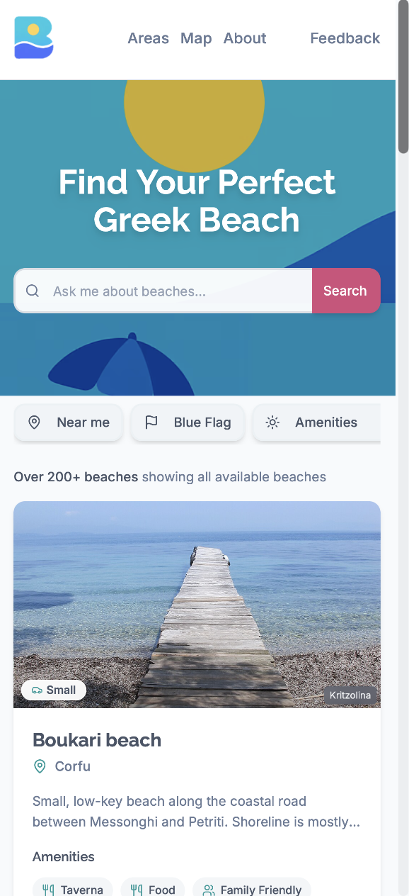
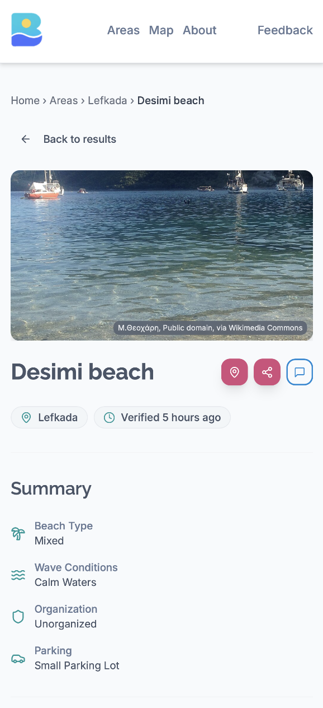
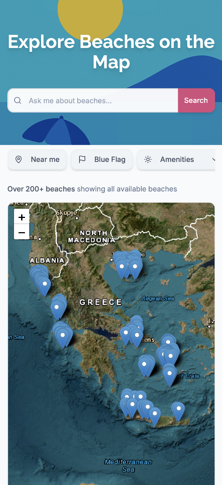

# Beaches of Greece 🇬🇷

> **Built by [Tomer Liran](https://github.com/tomerlir)** — solo founder project. Presented at **Google Frankfurt's AI Founders Connect**. CTO & Co-Founder at [Bridge](https://usebridge.ai).

AI-powered beach discovery. Natural language search across 200+ Greek beaches with detailed amenities, photos, location data, and Blue Flag certifications. Built to answer: "find me a quiet sandy beach with a taverna near Heraklion."

**Live:** [beachesofgreece.com](https://beachesofgreece.com)

## Screenshots

| Homepage | Beach detail | Areas | Map |
|---|---|---|---|
|  |  |  |  |

## Features

- **Natural language search** — conversational queries with NLP-powered filtering
- **Beach detail pages** — photos, amenities, beach type, wave conditions, organization status, parking info
- **Area-based browsing** — explore by Greek regions and islands
- **Interactive map** — Leaflet-powered with beach markers across Greece
- **Blue Flag filtering** — environmentally certified beaches
- **Geolocation** — find beaches near you

## Tech Stack

- React 18 + TypeScript + Vite
- Tailwind CSS + shadcn/ui
- Supabase (PostgreSQL) with Row Level Security
- Leaflet + React Leaflet for maps
- TanStack Query for data fetching
- Wink NLP + Compromise for natural language search
- Vitest + ESLint

## Running Locally

```bash
git clone https://github.com/tomerlir/beach-atlas-greece.git
cd beach-atlas-greece
npm install
cp .env.example .env.local   # add your Supabase URL and anon key
npm run dev                   # starts on http://localhost:8080
```

## Project Structure

```text
src/
  components/           # UI components (shadcn/ui, auth, admin, breadcrumbs)
    admin/
    auth/
    ui/
  contexts/             # React contexts
  hooks/                # custom hooks
  integrations/
    supabase/           # Supabase client + generated types
  lib/
    nlp/                # natural language processing
    explanations/       # search explanation logic
  pages/
    admin/
  types/
  utils/
```

## License

MIT — see [LICENSE](LICENSE)
